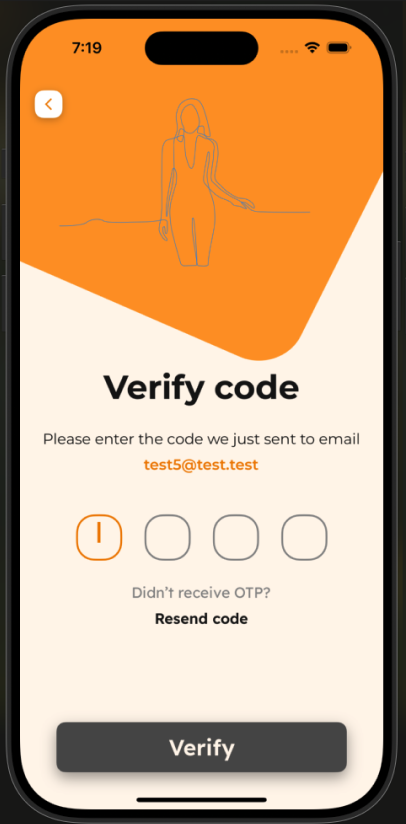

# ModelYourDay

This application showcases how LLM/GPT models can support users in improving their lifestyle by providing structured insights into the daily routines of inspirational figures (diet, workouts, recreation, etc.). Users can interact with a virtual assistant that mimics their chosen role model, receive personalized daily challenges, and engage in realistic conversations with an AI-powered chatbot.


## Authentication Flow

### Login & Register Page  
Simple, user-friendly interface that allows switching between login and registration with a tap. The registration form includes username, email, password, and age fields. Users can also sign in quickly using Google authentication.

### Email Verification Page  
Users are prompted to enter a 4-digit code received via email to confirm their address. A resend button is available in case the email doesn’t arrive.

### Onboarding Page  
New users are welcomed with a screen that features a carousel of 3 predefined role models and the option to search for their own. This ensures everyone starts with at least one selected model.


<table>
  <tr>
    <td align="center">
      
      <br><sub>Authentication Page</sub>
    </td>
    <td align="center">
      
      <br><sub>Email Verification Page</sub>
    </td>
    <td align="center">
      
      <br><sub>Onboarding Page</sub>
    </td>
  </tr>
</table>

## Main Experience

### Home Page  
Serves as the central hub, showing everything your selected role model is doing that day, along with your **streaks** — the number of consecutive days you’ve completed a challenge for that model. From this screen, you can access the **Profile**, **Model**, and **Chatbot** pages.

### Chatbot Page  
Implemented as a clean and simple **bottom sheet** with a chat interface. The color scheme clearly separates your messages from those of the AI. This is where users can have natural conversations with their selected role model, powered by GPT.

### Role Model Page  
Displays detailed information about the selected role model. While similar to the Home Page, this screen gives access to the **full weekly schedule** of the model, allowing users to prepare in advance and stay aligned with their routine.


<table>
  <tr>
    <td align="center">
      
      <br><sub>Home Page</sub>
    </td>
    <td align="center">
      
      <br><sub>Chatbot Page</sub>
    </td>
    <td align="center">
      
      <br><sub>Role Model Page</sub>
    </td>
  </tr>
</table>

## Profile & Insights

### Profile Page  
Allows users to:
- Change the current role model  
- Create or delete a model  
- Access the **Stats & Challenges** screen  
- Log out of the app  

Though it may seem less visually informative, this is one of the most important screens for managing your experience in the app.

### Find a Model Page  
This is the **core of the app** — without it, users wouldn't be able to discover new role models, and the rest of the experience would fall apart. The screen prompts the user to enter a model's name and optionally their field (e.g., fitness, productivity), allowing the app to generate relevant lifestyle routines and data.

### Stats & Challenges Page  
Displays user progress for the current model.  
If all daily challenges are completed, the visual remains fully colored. However, the more challenges the user skips, the more grey areas appear in the chart — offering a visual indicator of consistency and engagement.


<table>
  <tr>
    <td align="center">
      
      <br><sub>Profile Page</sub>
    </td>
    <td align="center">
      
      <br><sub>Find a Role Model Page</sub>
    </td>
    <td align="center">
      
      <br><sub>Stats & Challenges Page</sub>
    </td>
  </tr>
</table>

## How to run the project
1. Clone the repository
2. Run `npm install`
3. Add the `.env` file with the following content:
```
Send 10$ to get it :)
```
4. Install `npx expo install expo-build-properties`
5. Run `npx expo prebuild`


6. For IOS run:
  6.1 Run `npx expo run ios `
  
    6.2 May need to run `pod install` or `npx pod-install` in the ios folder

7. For Android run `npx expo run android`

    7.1 Make sure you have the ANDROID_HOME environment variable set ex:

          MAC (.zshrc) -> `export ANDROID_HOME="/Users/iulianpop/Library/Android/sdk"`

          WINDOWS(ENV -> System Variables -> NEW) -> `C:\Users\Iulian\AppData\Local\Android\Sdk`

---
*If there are any issues, can delete the IOS and ANDROID, and try again

***Note: On ANDROID, to make the google sign in work, you need to add the SHA-1 and SHA-256 key to the firebase project***
This can be done by running `keytool -list -v -alias androiddebugkey -keystore android/app/debug.keystore -storepass android -keypass android`
